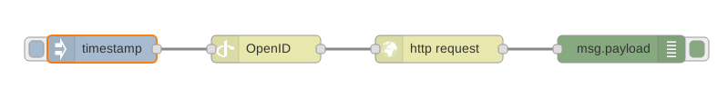

node-red-contrib-openid
=======================

[Node-RED][nodered] node to use OpenID Connect with HTTP nodes.

This node uses the certified OpenID client library:
[node-openid-client][node-openid-client]



Install
-------

Run the following command in the root directory of your Node-RED install

```bash
npm install node-red-node-openid
```

Usage
-----

### OpenID node

Once authenticated with the OpenID provider, each message passing through this
node obtains a fresh access token.

This access token is stored into this message property: `msg.access_token`

In order to be usable with the HTTP node, the access token is also added to HTTP
headers: `msg.headers['Authorization']`


[nodered]: https://nodered.org/
[node-openid-client]: https://github.com/panva/node-openid-client
